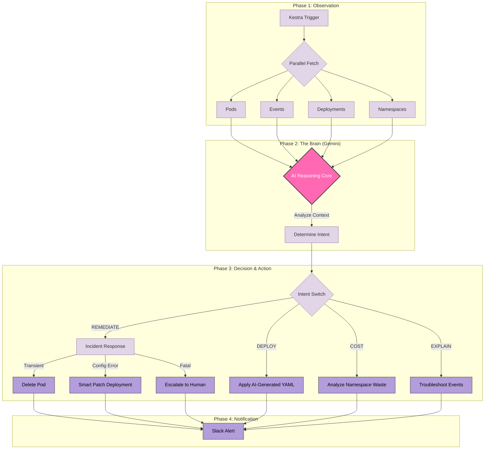

# 🛡️ AegiOps: The Autonomous AI SRE

> **The AI Site Reliability Engineer that saves your sleep by fixing Kubernetes crashes before you even wake up.**

---

## 📖 About The Project

We've all been there: waking up at 3 AM just to restart a stuck pod or fix a typo in a YAML config. We built **AegiOps** to end that burnout. It’s an autonomous agent that lives inside your cluster and acts as your first line of defense.

Instead of just spamming you with Slack alerts when things break, AegiOps actually **fixes** them. It watches your infrastructure in real-time, uses Gemini AI to understand *why* an error is happening, and executes the right remediation strategy automatically via Kestra.

### ✨ Key Capabilities
* 🚑 **Self-Healing:** Detects crashes and performs safe restarts (Transient) or config patches (Drift).
* 🏗️ **Text-to-Infrastructure:** "Deploy Redis with 3 replicas" → Automatically generates and applies manifest.
* 💰 **FinOps:** Identifies "Zombie Namespaces" wasting resources.
* 🧠 **Deep Analysis:** Explains complex event logs in plain English.

---

## 🏗️ Architecture

AegiOps uses the **Observer-Orient-Decide-Act (OODA)** loop, orchestrated entirely by Kestra.

